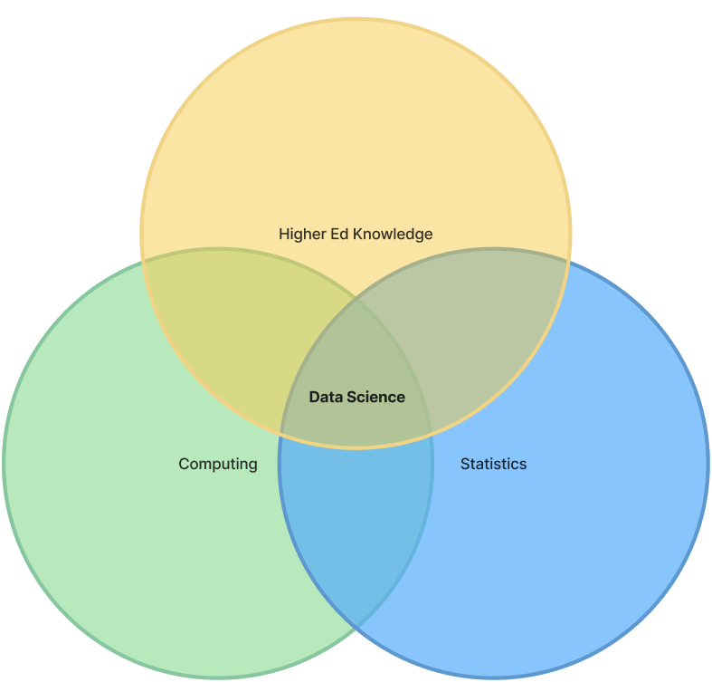

# Data Science Explained

## What is higher education?
The UNESCO (2026) definition is widely accepted and is paraphrased as the teaching and learning battery offered at institutions beyond secondary education. For the learner and as a general insight, there are basically two threads that run through higher education—career training and learning to think. Sometimes these domains directly overlap, like where a liberal arts student learns to read thoroughly and syntopically in a humanities course, and such a skill transfers over cleanly to a career as a lawyer. Other times courses exist to enrich the lived experience of the student—like an 18th century poetry course—and such knowledge might not map neatly to a career outcome, at least in an easily quantifiable way. The other thread foregrounds the job as its main impetus, training students to perform tasks such as in a computer science course.

## What is data?
Data are (plural of datum) recorded observations about the world (Witte & Witte, 2017). Examples could include numeric student survey data for the assessment of a course, qualitative narrative posts on a learning management system's discussion board, or pictures of cats. Data can be encountered—like campus weather patterns—or constructed—such as end-of-course feedback.

## What is science?
Science is a knowledge system that is positioned in the experiential and observable world (Britannica, 2026). Importantly, the knowledge generated can be verified and even proven false by others.

## What is data science?
Data science is the discipline of learning from data (Grus, 2019). Essential to its practice is the notion of **auditability**, where practitioners approach data science work in a way that can be verified by others.  

## What is applied data science?
Applied data science is defined in many ways if one sources the definition online. It can also be largely dependent on where the term is utilized if seeking a use-case explanation. Generally, it can be thought of as an approach to working with data so that something useful and trustworthy is produced (Shah, 2020). This output could be for example, a helpful understanding to support a data-informed decision, a model to deliver predictions about an outcome of interest, a clarifying visualization, a report, or an intervention program to serve the university rooted in verifiable data science.

## What is applied data science in higher education?
Applied data science within the higher education context is defined by the empirical activities that practitioners engage in within a shared structure (Kuhn, 1962) to learn from and pursue results to serve educational stakeholders including, students, faculty, staff, administrators, and many others. Depending on the department and goal, several different pursuits are undertaken that all qualify as data science. These include:

Inferential Research
: A systematic investigation of a topic to understand relationships and differences in variables (Larimore, 2021). Such work is frequently driven by theories, hypotheses, and research questions. Inferential work is about understanding *why*.

Data analytics
: The process of examining existing datasets to surface patterns and associations (Tableau, 2026). It is undertaken to know *what* happened and to answer operationalized questions of interest, not for the production of generalizable knowledge.

Machine learning
: Commonly, these are methods that use datasets to train an algorithmic model to predict a continuous or categorical outcome variable, without explicitly programming the computer (Microsoft, 2026). Machine learning is often driven by the performance of the model where accuracy is often most important so that predictions in the applied setting are helpful. Other varieties exist for identifying patterns or teaching a computer to make decisions through rote trial and error.

Data mining
: Data mining makes use of large datasets to unearth unknown patterns and groups in data. It is driven by discovery and not neccessarily a hypothesis.

### Methods
The table here shows an example of each method discussed for conducting data science:

|Method| What could this look like in higher education?|
|:------|:---------------------------------------|
|Inferential Research | A study is conducted to understand the association between class size and gpa. |
|Data Analytics | University website traffic is analyzed and the most utilized sections are improved. |
|Machine Learning | A model is created to predict enrollment numbers for next semester. |
|Data Mining | All university LMS activity stream data from the previous 10 years are mined for insights. |

: Data science activity in higher education. {#tbl-ds-activities}

## Data science projects

Data science projects are the heart of the application of data science in the real world. They are engaged with to solve a problem for key stakeholders, such as increasing enrollment numbers, identifying students at risk of withdrawing, or increasing graduation rates among first-generation students. 

### Define the data science problem (Phase One)
Good data science starts by thoroughly understanding the issues faced and careful planning. Example iterative steps in a data science project workflow is presented in the table here. Importantly these steps may not occur in sequence and can be revisited as needed, which is likely often depending on the project.

|Stage| Action | Considerations |
|:----|:-------|:-------------- |
| Frame the problem | State the pain point and explore the problem at a high level| What is the issue experienced? |
|Gather context | Explore the problem and solution space at depth through techniques such as interviews and surveys. | Seek to understand why the issue is important to the stakeholders. |
| Develop a plan and assess feasibility | Compare different solution possibilities considering the available data, effort, and expertise. | Frequently, lower effort work that is of high importance is prioritized. |
|Align Stakeholders | Update and involve stakeholders throughout the project. | This step is highly iterative and can be accomplished with standard methods or for-purpose solutions such as project management apps. | 

: Steps for the problem phase. {#tbl-ds-p1}

### Execute the work (Phase Two)
The next phase is about accomplishing the data work. It can broadly happen across actions with and about the data that include ingesting, storing, cleaning, analyzing, communicating results, implementing, and iterating.

Ingest
: Capture the data from sources such as from surveys or learning management systems.

Store
: The data needs to be kept somewhere that is reliable and secure, such as a database which we will discuss in the next chapter.

Clean
: Wrangle and clean the data—such as by fixing missing values or errors—so it can be effectively worked with.

Analyze
: Explore the data and create visualizations and models to solve problems.

Communicate
: Report and present findings to stakeholders for buy-in and to plan actions.

Implement
: Bring to fruition the insights from the data via output such as process changes, assistive programs, or software.

Iterate
: Monitor and assess the implementation, reworking and revising as needed by stakeholders.

## The applied data scientist in higher education

Applied data science in higher education sits at the intersection of applied coding, applied statistics knowledge, and higher education domain knowledge. Working with data via code is highly efficient and provides a means for auditability through transparent scripts. Knowledge of statistical methods enables sound reasoning for deriving insights from data. The domain knowledge in higher education is what gives pragmatic meaning to the outputs of a data science project.

{#fig-ds-venn width="425px" height="400px" fig-align="center"}

## Chapter 1 Exercises:

::: {.callout-note icon=false title="Exercises"}

1. **Enrollment data exploration.** Use this [small higher education dataset](data/7160_module1_student_enrollment.csv){download="7160_module1_student_enrollment.csv"} to answer the following. You can use any program you're comfortable with (e.g., Excel, SPSS, or R).

    a. **Understanding student workload variation.** As a new academic advisor, you want to get a sense of how spread out your students' course loads are before your first round of meetings. Some students may be barely enrolled while others may be overloaded — both groups might need outreach for very different reasons. What is the range of credits enrolled (lowest to highest), and what does that spread suggest about the kinds of conversations you should be prepared to have? What additional data not in the dataset could help you answer this question?

    b. **Estimating a typical credit load.** Your dean asks, "What's a typical credit load for our students this term?" before a budget conversation about instructional capacity. What is the average credit load, and — looking back at the range from part a — is the average actually a fair representation of "typical" here, or does the spread complicate that story?

    c. **Resource allocation across programs.** The student services office is deciding where to assign three new peer mentors and wants the placements to reflect where the students actually are. Build a bar graph showing the number of students in each program. Based on the chart, where would you place the mentors, and what is one piece of information not in this dataset that would change your recommendation?

2. **Consult the literature.** Find a scholarly article about the applied usage of data science in higher education written in the last four years. I recommend looking on Google Scholar. Create a one page document answering the following questions. Also provide a correctly formated APA citation with a link to the article. 
    
    a. **Summarize the problem.** What institutional problem or question of interest was addressed by the authors?
    
    b. **Identify methods used.** What methods (e.g., data mining) were utilized in the paper and how?
    
    c. **Track the workflow.** How does the article relate to the data science project workflow (e.g., framing the problem, analyzing the data)? What parts are mentioned explicitly? Which were implied or omitted?
    
    d. **Trustworthyness** What steps did the authors take to ensure that their results were trustworthy and addressed the problem? What was discussed and what was left out?

:::

