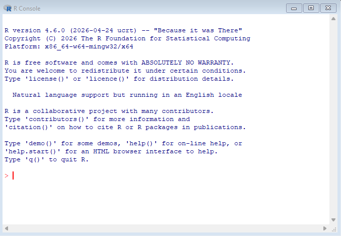
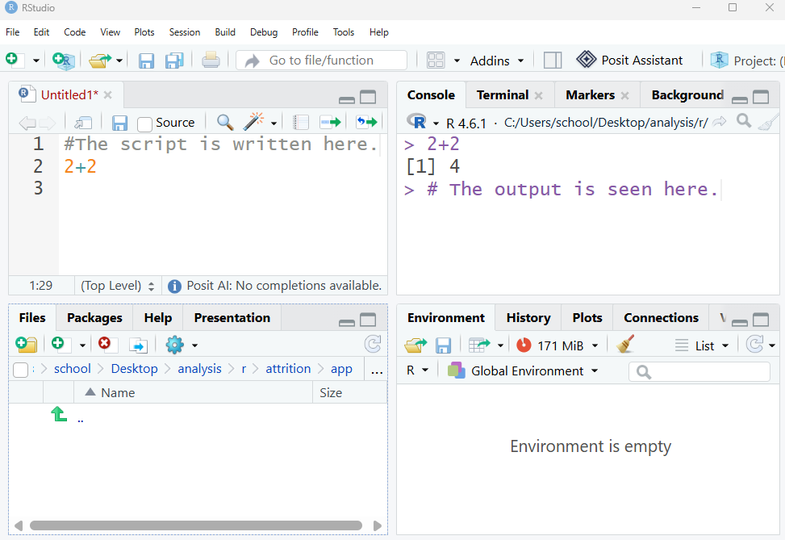
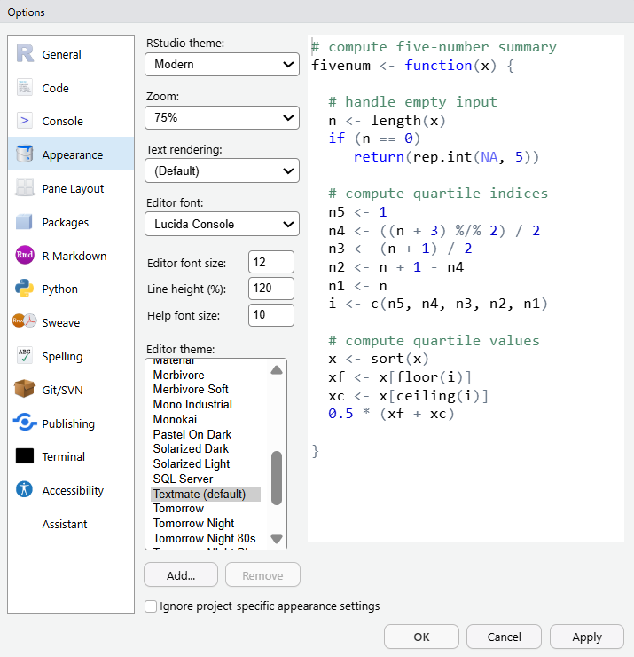
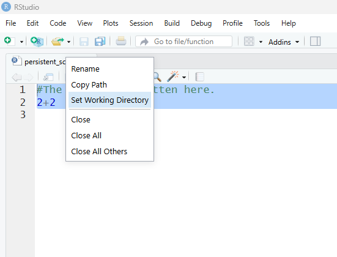
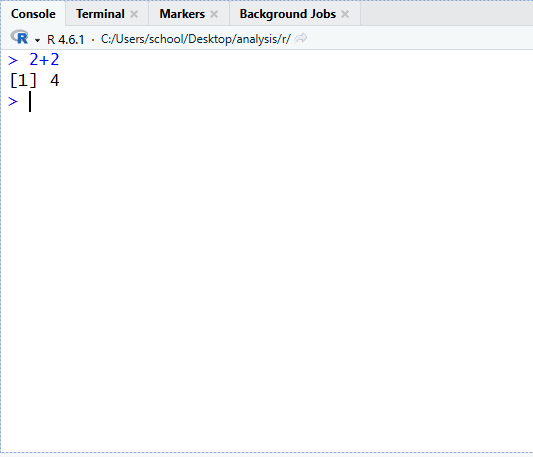
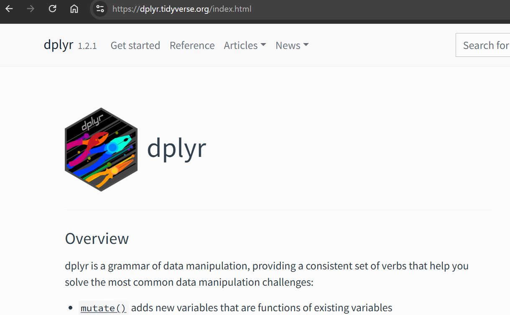

# R Orientation

## What is R?
R is a functional language built specifically for working with data. Professionals who work with data such as statisticians and researchers are actively involved in shaping the language. In a sense, R is a *living* body of work that is constantly underdevelopment, evolving as the needs of its users do. As higher education data professionals, we use it because it is highly efficient, auditable, scalable, and yields reproducible work that can be assessed to establish trustworthyness.


### A brief history of R
The history of the R can be traced back to the 1970's where John Chambers and his colleagues at Bell Laboratories developed a commercial language called S. R was developed in the 1990s by the statisticians Ross Ihaka and Robert Gentleman as a free and open language for everyone that built on principles from S. R was first released to the public in 1993.

### R and higher education
R is widely utilized in a variety of industries including biology, pharmaceutical research, and higher education. It is free and can be used to work any other programs (e.g., Excel, SPSS) which is important when working across departments, divisions, and companies where everyone may have their own preferences for statistical software. Although completely free and open, R is of the highest quality tools for working with data. As it is continuously updated by a global community of users, the latest statistical and analytic methods are available in R often well before they are incorporated into commercial software.

### R and IDEs
R is the language that interprets our typed commands into instructions that the computer carrys out. An **Integrated Developer Environment** (IDE) is an application that makes it easier to work with R. Where working with the R interpreter itself is a more minimal experience—essentially where flat text is typed into a prompt—an IDE gives us features such as display windows to see our plots and menu options to save files.

{#fig-rstudio width="600px" height="400" fig-align="center"}

## RStudio
RStudio is a free and open source product created by the public benefit corporation Posit. It was officially released to the public in 2016 and is the most common IDE for R. R can be thought of as the language that sits under the hood of RStudio performing the work that we outline in the IDE. 

RStudio organizes work across several windows called **panes**. There are several of them but some of the most useful are:

Source
: This is the text editor where the reproducible script file is created. It is persistent and can be saved.

Console
: The results of the script appear in the console, such as mean values or descriptive stats for a dataset. The console is also interactive meaning that code can be directly entered here. This is helpful for code you want to execute but don't need to persist in your script, such as arithmetic calculations or accessing help files.

Environment
: The environment pane displays the objects that are accessible to R in device memory. These can be things like imported datasets, variables, and values.

Files
: The actual files sitting in your device that can be loaded into the environment are displayed in the files panel.

Plots
: The plots pane shows us the data visualizations we create in our analysis. They can be exported from there too. 

The image shown below shows a possible configuration of the RStudio panes, which are customizable.

{#fig-rstudio width="600px" height="400" fig-align="center"}


### Install
**R** can be downloaded from the Comprehensive R Archive Network (CRAN). Navigate to <https://cran.r-project.org/> and select your operating system (e.g., Windows) to download the correct installer. Run the installer typically with the default settings and verify a successful installation by opening R once it has completed.

**RStudio** can be downloaded from Posit at <https://posit.co/downloads>. Again, select the installer based on your OS, run it with default settings, and verify it by opening the application when complete.  

## R and AI
Generative artificial intelligence (AI) has revolutionized coding in general. Large language models (LLMs) are very capable at aiding humans in the creation of code. Natural language can be used to prompt AI chatbots for working code, in a matter of seconds or minutes for many requests. With this in mind, it is important for both the learner new to R and the professional working in an applied capacity to remain in control of the assistance output by AI. When learning, I recommend using AI as a helper and assistant for scaffolding one's knowledge development to help ensure coding skill growth, as opposed to relying on the tool for working results that are not understood. Importantly, understanding and owning every line of code is essential to quality and trustworthy data science with R.

### Modes of operation
Presently there are two modes of operation to consider when utilizing AI in a data science workflow.

1. **Copying and pasting to an external chatbot.** In this mode, code is copied from the IDE over to the chatbot as needed for help and assistance. This mode is helpful for learning as it is manual and only relies on AI as needed.

2. **Integrated chatbot in the IDE.** This a more advanced mode of learning where the chatbot sits within the IDE editing and recommending code as the work progresses. This mode is more suitable for advanced practitioners who have a firm understanding of R. Using this approach while developing skills can potentially lead to over reliance and unintended destructive code results if the edits made by the bot are not completely understood by the human.

## Working in RStudio
### The Environment
When coding with RStudio, the **environment** refers to all of the objects (e.g., data, functions, variables) held in the computer's memory for the session. The environment pane displays these. It is always a good idea to inspect what is there when initially loading the program as objects are not by default removed from the environment when closed. This setting and others, such as the appearance of the UI in RStudio, can be updated in the menu path **Tools > Global Options**.

### Global Options
{#fig-options width="400px" height="400px" fig-align="center"}

### The persistent reproducible script
The heart of working in R is the script file where code is typed and saved. To create a new script file navigate to the menu **File > New > R Script**. Setting a working directory tells R where you are working so it knows where to look for files and where to save new ones. Importantly for the new learner, saving the script file to a folder location where your other relevant files will be, such as alongside your datasets, will be the easiest way to proceed. Otherwise you will have to specify a folder path telling R how to get there. You can issue the setwd() command or right click your script file and choose the option in the UI.

Example commands for setting the working directory are here. You will have to edit them to reflect your specific path on your device.
```r
# Windows
setwd("C:/Users/yourname/Documents/my-project")

# Mac
setwd("/Users/yourname/Documents/my-project")
```

The menu option is likely simpler and is accessed by right clicking the script file tab seen here.

{#fig-setwd width="400px" fig-align="center"}

As you are working in your script, to execute the code place the mouse cursor on the line you want to execute and type  **Ctrl+Enter**. For code statements that are several lines long, R is smart enough to run the complete statement. Remember to frequently save your scripts with **Ctrl+S**. Also, to run code outside of your script—like a simple one-off calculation for example— you can still enter code interactively in the console pane.

{#fig-console-command width="400px" height="350px" fig-align="center"}


## Packages
**R packages** are how the base R language is extended to have more capabilities. Packages consist of functions, data, and documentation. Packages are written by the R community to accomplish particular tasks such as creating graphs or working with Excel files. Packages must be installed once on a device and then be loaded into memory every time. 

Here is the code for installing and loading packages, which is typically placed at the top of a script:

```r
# Install a package (once)
install.packages("packagename")

# Load a package (each session)
library(packagename)
```


## Help and explanations
Getting stuck (i.e., blocked from progressing in ones work) happens to everyone who has ever coded. It is a natural and expected part of the experience. There are several ways to get help when this happens.
### Comments
Comments in R are not executed as part of the code but are for humans to read and understand. Thoroughly comment your code so that you will understand it if you pick it up at a later time or if it is passed to someone else. Comments start with a #.

An example comment is here.

```r
# The mean function calculates the average gpa.
mean(gpa) # The code is on this line; Everything behind the '#' is ignored by the R interpreter.
```
### AI
AI has transformed our ability get help when stuck as new learners or when engaging with advanced topics as higher education data professionals. As was mentioned, understand and own every piece of AI output incorporated in your work to ensure accountability, learning progress, and clarity.

### Online function documentation
If AI does not provide sufficient information when seeking help, the built-in documentation for a function can be accessed with `?`, such as by typing `?mean`. This type of assistance is not recommended for the new learner as it can be opaque and is organized like it was created for robots. Instead it is better to access package documentation directly on user-friendly websites. For example, if working with the dplyr package, searching for this package's documentation quickly surfaces a much easier to use reference experience at <https://dplyr.tidyverse.org/index.html>, complete with a search function and integrated AI.

{#fig-dplyr-doc width="600px" fig-align="center"}

### Help Resources
There are an abundance of R resources online that are well organized and easy to use. Just a few general ones are on the table below.

| Resource | What it is | Link |
|:---------|:-----------|:-----|
| RDocumentation | Searchable function documentation | <https://www.rdocumentation.org> |
| rdrr.io | Documentation for many packages | <https://rdrr.io> |
| Posit Cheatsheets | Quick guides for some packages | <https://posit.co/resources/cheatsheets> |
|tidyverse | Posit's tidyverse documentation. | <https://tidyverse.org/> |

: R resources. {#tbl-r-resources}


## Community resources
The R language and related packages has a very active community where news, resources, and help is offered. Here are some that high-quality.

| Resource | What it is | Link |
|:---------|:-----------|:-----|
| R-bloggers | Many R blog posts aggregated | <https://www.r-bloggers.com> |
| Posit Blog | Official Posit news and resources| <https://posit.co/blog> |
| R Weekly | Weekly collation of R news | <https://rweekly.org> |
| Stack Overflow | Discuss specific coding issues | <https://stackoverflow.com/questions/tagged/r> |

: R community resources. {#tbl-community}


## Chapter 3 Exercises

::: {.callout-note icon=false title="Exercises"}

1. **Set up your environment.** Get R and RStudio working on your own device.

    a. Install R from CRAN and RStudio from Posit. Open them both to ensure they work.
    b. Identify the Source, Console, Plot, and Environment panes. Describe in a sentence what each one is for.
    c. Create a new script, save it to a folder, and make that folder the working directory.

2. **Practice finding help.** Use each help method from this chapter on the `mean` function.

    a. In the console, run `?mean` and explore the documentation with AI, asking for details and clarity on anything you don't understand (e.g., specific arguments like 'trim'). 
    b. Document some information the help page tells you identifying where you relied on AI for clarity and what you extracted from the documentation unaided.
    
3. **Explore a package with AI.** Search for a new R package and learn about it.

    a. Find a package that is professionally relevant to you.
    b. Use AI to help you understand it, documenting your process and knowledge.
    
:::


