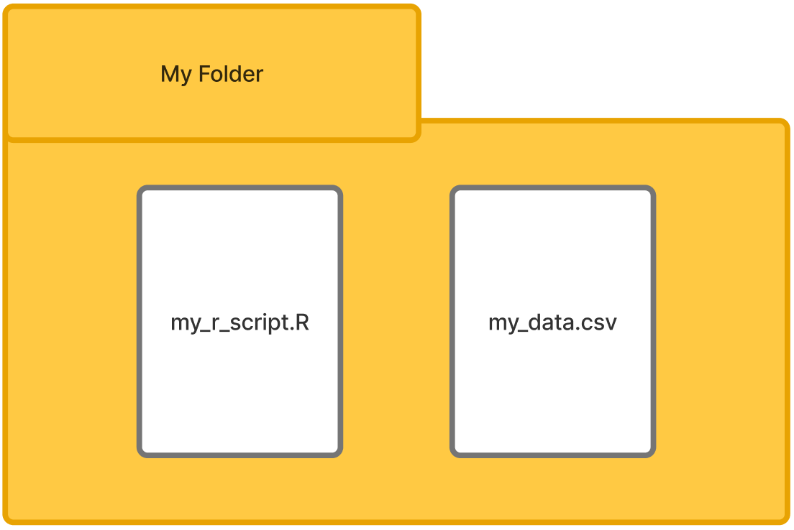

# R Basics

## Context
### A note about base R and tidyverse
Throughout this book you will see two threads of work. Where possible we will rely on the **tidyverse**, a collection of packages first developed by Hadley Wickham and now maintained by Posit. These packages offer an improved way of working with R overall. When it is needed or is more efficient, we will switch to **base R** which refers to the default capabilities that the language includes, or other packages outside of the tidyverse.


## Setup and packages
### Create a new script
For this chapter, create a new script file **(File > New > File R Script)** and save it to a folder where you will also save data files. An example script file is show here for how you might structure one in your work. 

{#fig-folder width="525px" height="400" fig-align="center"}

Typically, there is some information about what the script is all about up top. The packages for the script are located before the work happens so they are pre-loaded. Data are imported, inspected, and prepared before the analysis occurs. To help the flat script file appear more visually structured, each section can be divided with continuous underscore characters creating lines, for example.


```r
#________________________________________________________
# Title:    Generic Example Script File
# Analyst:  Your name
# Date:     The date
# Purpose:  The purpose of the wok in the script.
#________________________________________________________

#________________________________________________________
# Step 1. Install/ Load packages
install.packages ("package_name") # Only once
library(package_name) # Each session


#________________________________________________________
# Step 2. Set working directory(optionally use RStudio GUI instead)
  setwd("C:/users/name/documents/folder")


#________________________________________________________
# Step 3. Import data
data_frame <- read_csv("your_data.csv")


#________________________________________________________
# Step 4. Inspection of loaded data
glimpse(data_frame)   # Shows columns types and sample values.


#________________________________________________________
# Step 5. Data preparation
# Many actions could be taken here such as dropping missing values.
data_frame <- drop_na(data_frame)


#________________________________________________________
# Step 6. Analyze the data
# The analysis will proceed after these initial steps.
```


### Load packages
For the work in this chapter, first install and then load the following packages:

```r
# Install 
install.packages("tidyverse") # Only once

# Load 
library(tidyverse) # Each session
```
```{r}
#| label: setup
#| include: false
library(tidyverse)
```


## Basics

### Functional syntax
Most work in R is the result of executing pre-defined **functions**. These operators take some data as input, work with it in some way, and then output the result. These functions take **arguments** that tell them what to work on or adjust their behavior. 

Here is a generic function syntax:
```(r)
function_name(data, argument_1)
```

Here is the mean() function in action:

```{r}
mean(c(10, 50, 100))
```


### Objects
Everything created in R is stored in memory as an **object**. Objects can be thought of as containers which we give a name to identify them by and access them again later. You can see a list of the objects that R currently has in memory in the environment pane of RStudio or by running the command `ls()` in your console.

### Data frames and tibbles
Data are brought into your environment to be worked with and that is what this chapter is about. Data are imported into R as objects. The default object is called a **data frame**. Data frames are base R's way of bringing in tabular data made of rows and columns. The tidyverse has improved on the data frame,importing tabular data as **tibbles**. A tibble has some subtle smart features that make them easier to work with and they are also compatible across the range of tidyverse packages.

### Variable types
Each column that you import into R has a **data type** so it knows the kind of values that are represented by the variable. The data type determines the types of actions that can be taken when working with data. Multiplying red (character) by cat (character) is beyond the capabilities of the language, for example. The table here shows the different types that are commonly worked with.

| Type | Name | What it holds | Example |
|:-----|:-----|:--------------|:--------|
| `chr` | Character | Text | Business Major, Student IDs |
| `dbl` | Double | Numbers, with or without decimals | 1, 1.3 |
| `int` | Integer | Whole numbers only | 10, 100000 |
| `lgl` | Logical | Boolean values only | TRUE, FALSE |
| `fct` | Factor | Categorical values with fixed groups | First-Generation |
| `ord` | Ordered Factor | Categorical variable with meaningful ranks | Freshman, Senior |

: Common R data types. {#tbl-data-types}

### Operators
Operators are symbols used by R to work with values. **Assignment** operators let us assign values directly to named objects. **Arithmetic** operators are used for working with values via common arithmetic methods, such as multiplying or adding. **Comparison** operators compare two or more values. They return a logical result, either `TRUE` or `FALSE`.**Logical** operators let us take the results from two or more logical comparisons (i.e., conditions) and returns a single logical result, either `TRUE` or `FALSE`.

```{r}
# Assignment________________________________ 
# See these values in your environment pane.
credits <- 15
program <- "Biology"
full_time <- TRUE


# Arithmetic operators________________________________
credits + 3      # addition
credits - 3      # subtraction
credits * 2      # multiplication
credits / 2      # division
credits ^ 2      # exponent
credits %% 4     # modulo (remainder)


# Comparison________________________________
credits > 12     # greater than
credits < 12     # less than
credits >= 15    # greater than or equal to
credits == 15    # equal to
program != "Business"   # not equal to

# Logical________________________________
full_time & (credits > 12)   # AND - both must be TRUE
full_time | (credits < 12)   # OR  - either can be TRUE
!full_time                   # NOT - reverses the TRUE value
```


## Other data structures
Beyond the tabular data frame and tibble, data in R are structured a few different ways. Here are some common ones.

Vector
: A simple ordered set of values that are all the same type, numbers for example. All columns found in a data frame are vectors. 
`credit_hours <- (10, 20, 30)`

List
: Can be considered a 'container' for holding a mix of data types of even other structures.
`student <- list(id = "S001, credits = 12)`

Matrix
: A grid of values that are all the same type; organized by rows and columns. 
`scores <- matrix(id = "S001, credits = 12)`


```{r}
# Vector________________________
credit_hours <- c(10, 20, 30)
credit_hours

# List________________________
student <- list(id = "S001", credits = 12)
student

# Matrix________________________
scores <- matrix(c(88, 92, 75, 80), nrow = 2)
scores
```


## CSV files
Commonly, datasets are in flat CSV files that we want to analyze. These files are typically an option to export from other systems such as an LMS in higher education, so it is useful to know how to work with them.

### Example workflow
Download the small student dataset here to try importing it:
[student dataset](data/7160_module1_student_enrollment.csv){download="7160_module1_student_enrollment.csv"}

For this import we are using the tidyverse package called **readr**. readr imports your data as a tibble and reports on the types of columns imported.It chooses these types by inspecting the data automatically and determining what is there. Sometimes this may not be right for what you want to accomplish with the data. For this workflow, we load the data, confirm it is there, change a column type, and then re-inspect to see that the type was changed as expected.


```{r}
#| label: explore-enrollment
#| message: false
# Load the CSV into a tibble called enrollment.
# Note that my data are in a folder called "data"; 
# If your script and your data are in the same folder, run this instead
# enrollment <- read_csv("7160_module1_student_enrollment.csv")
enrollment <- read_csv("data/7160_module1_student_enrollment.csv")

# Inspect the data.
glimpse(enrollment)   # All columns with their type and sample values
head(enrollment)      # See the first six rows

# Change the Program variable from text to a categorical variable.
enrollment$Program <- as.factor(enrollment$Program)

# Confirm the changed variable type.
glimpse(enrollment)
```

## Chapter 4 Exercises:
::: {.callout-note icon=false title="Exercises"}

1. **Run and explain this code** Here is readr in action again, this time with arguments we did not use.

    a. Run this code using the same dataset as before and explain what it does now.
    b. Search out the documentation on the readr package and explain your understanding of these additional arguments.
    c. What argument could you use to load Credits_Enrolled as a data type that only accepts whole numbers?

```r
enrollment <- read_csv(
  "data/7160_module1_student_enrollment.csv",
  col_types = cols(
    Student_ID = col_character(),
    Program = col_factor(),
    Credits_Enrolled = col_double()
  )
)
``` 

2. **Consult the documentation.** Use the readr documentation to answer the following questions.

    a. What is the default value of the `col_names` argument for `read_csv()`? What does it do?
    b. The what function would be used to load a tab seperated file?
    c. Explain what does the skip argument does and give an example practical use case.

3. **Build and load a CSV dataset.** Create a small dataset that is higher education related.

    a. In Excel, create and save a dataset as a csv file with a header. It should have four columns and ten rows. There should be at least one text column and one numeric column. Also create a new R script and save that to the same folder.
    b. Load your dataset with readr and assign it to a named object.
    c. Examine it with the functions we used in the chapter for inspecting data and describe the output.
:::
