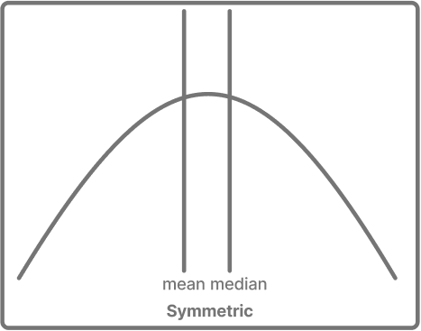
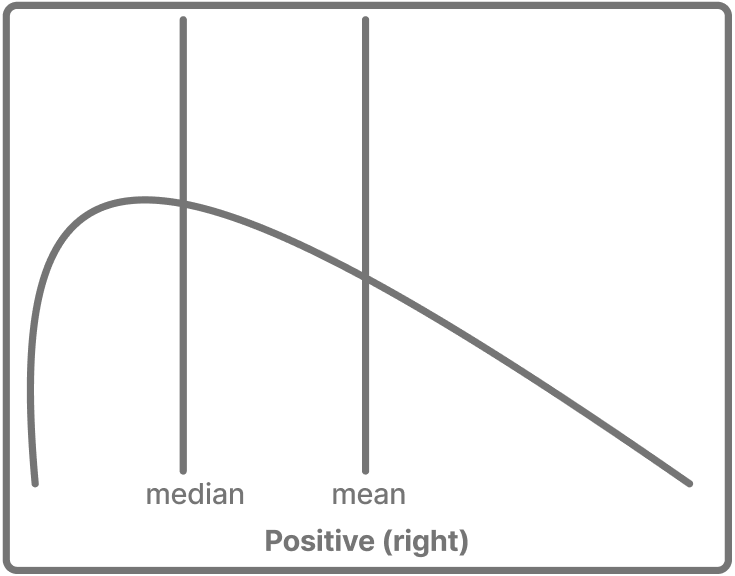
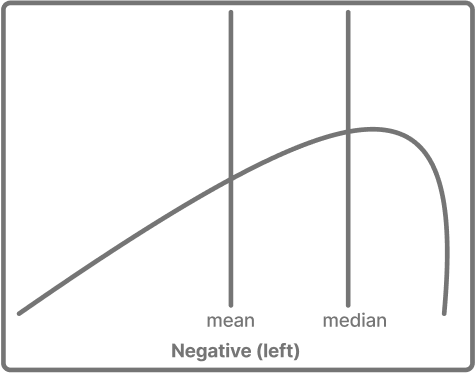

## Details
This module is about **exploratory data analysis (EDA)**, which is the practice of examining data to learn what it contains and what questions it raises, before any formal modeling begins. Good EDA is where a data professional uses intuition and methodical inspection to spot surprises and decide what is worth investigating further. Once data are tidy, the same dplyr tools we used to clean data in the last module can also help us understand it. We will also pick up a couple of helpful preprocessing steps along the way.


## Very brief stats
EDA leans on a handful of basic statistical ideas. A quick review is presented here that is enough to follow the chapter.


### Measures of central tendency
A **measure of central tendency** describes the "typical" value in a set of numbers. These three are common:

- The **mean** is the average where values are added together and divided by their count. It is a common stat, but it is sensitive to outliers with extreme values.
- The **median** is the middle value when the numbers are sorted. Half fall below it and half above. Because it ignores how far away the extremes are, it is less sensitive to them.
- The **mode** is the value that appears most often. It works for categorical and numeric data.


### Measures of spread
Central tendency refers to the middle of some values. **Spread** tells us how far the values scatter around it.

- The **range** is the distance from the smallest value to the largest. Simple, but driven entirely by the two extremes.
- The **interquartile range (IQR)** is the range of the middle half of the data. That is, the distance from the 25th to the 75th percentile. It describes the bulk of the values while ignoring the extremes.
- The **standard deviation (SD)** measures the typical distance of values from the mean. A small SD means values cluster tightly around the average. A large one means they are widely dispersed.


### Distribution, shape, and skew
**Skew** describes how lopsided the shape of a distribution is. Comparing the mean to the median surfaces the shape. A useful framing for understanding a distribution is that the mean chases the tail, being pulled toward the extreme values. The median is more resistant, so it sits near the middle. Whenever the mean and median drift apart, the direction of the gap tells you which way the data is skewed.


In a **symmetric** distribution, the values are balanced around the center and the mean and median sit close together. Example: In a well designed course, most students score roughly near the class average, with some scoring below or above this.

{#fig-sym height="250" width="300px" fig-align="center"}


A distribution has a **positive (right) skew** when a few large values stretch a long tail to the right. These high values pull the mean higher, so the mean sits above the median. Example: In a difficult course, most students score low, with a few high scorers stretching a tail to the right and pulling the mean above the median. 

{#fig-pos height="250" width="300px" fig-align="center"}

A distribution has **negative (left) skew** when a long tail stretches to the left. These low values pull the mean down, so the mean sits below the median. Example: In an easy course, most students score high, with a few low scorers stretching a tail to the left and pulling the mean below the median.

{#fig-neg height="250" width="300px" fig-align="center"}

## Two modes of EDA
EDA works through two complementary modes of working and it can be helpful to move between them often.

The first mode works with **values**, such as summaries, counts, and statistics. We might compute the average GPA by major, count how many students fall into each class standing, or find the highest and lowest values. Values are precise and let us compare and understand exactly.

The second mode works with **visual** elements. This could include plots that show skewness, histograms that the distribution of a variable, or a box plot that exposes outliers. Pictures can reveal patterns and data issues that a table of values can hide.

These modes work in tandem and are supportive of one another. Imagine we compute the average number of credits per major and notice one major's average looks oddly low. The number raises a question but doesn't answer it. So we plot that program's credits and see the distribution splits in two — a cluster of part-time students pulling the average down. The plot raises a new question, so we go back to the numbers to count how many are part-time.

## How visualization works with ggplot2
When we move to the visual mode, we build plots with **ggplot2**, a tidyverse package for making graphs. It works by layering a few simple pieces, and once you know them, most plots follow the same pattern. We keep visuals simple in this module and go deeper into ggplot2 later. The ggplot2 documentation is found here <https://ggplot2.tidyverse.org/>.

### Basic ggplot syntax
```r
ggplot(data, aes(x = ..., y = ...)) +   # start with the data and map variables to the plot
  geom_type()                           # add a geom for the shape you want to draw
```

- **Data** is where every plot starts and is passed to create visuals.
- **Aesthetics** map columns of your data to visual properties, such as which variable goes on the x-axis, which on the y-axis, or which controls color.
- **Geoms** draw the plot `geom_histogram()` draws a histogram, for example.
- **Stats** are the stats that are computed when drawing a plot with the geom. A histogram bins values into ranges and counts them, for example.
- **Layers** are added with the `+` symbol, stacking pieces onto the plot. You begin with the data and aesthetics, add a geom, then perhaps labels or a theme — each `+` adds another layer.

Put together, a plot reads almost like a sentence: take *this data*, map *these variables* to the axes, and draw them as *this shape*. A few common plot types seen in EDA are:

| Plot | Geom | Used for |
|:-----|:-----|:---------|
| Histogram | `geom_histogram()` | Seeing the shape of a numeric variable. |
| Box plot | `geom_boxplot()` | Identifying spread and outliers in a numeric variable. |
| Bar chart | `geom_bar()` / `geom_col()` | Viewing counts or comparisons across categories |
| Scatter plot | `geom_point()` | Showing the relationship between two numeric variables |
| Line chart | `geom_line()` | A trend over an ordered variable, such as time. |

: Common plot types and their geoms. {#tbl-plots}


### Basic visualizations with ggplot2 examples

First we import IPEDS data to use for the visuals. For these examples, we use the `adm2020` dataset from the IPEDS package, which has admissions information for U.S. colleges and universities, including application and admission counts, test-score requirements, and SAT/ACT score ranges. It has one row per institution.

```{r}
#| label: viz-demo-setup
#| message: false
library(tidyverse)
library(IPEDS)

# Show plain numbers instead of scientific notation (e.g., 2000000 not 2e+06)
options(scipen = 999)

# Real admissions data from the IPEDS package. It has one row per institution, with
# application and admission counts, and SAT/ACT score ranges.
admissions <- adm2020
glimpse(admissions)
```

#### Histogram
A **histogram** shows the shape of one numeric variable by binning its values and counting each bin. Here we look at the 75th-percentile SAT math score across institutions. The aes() function— short for aesthetics—maps a column of your data to a part of the plot. In aes(x = MTH_SAT_75), we map the SAT math score to the x-axis.

```{r}
#| label: viz-histogram
ggplot(admissions, aes(x = MTH_SAT_75)) +   # map the SAT math score to the x-axis
  geom_histogram(bins = 25)                 # bars count institutions in each score range
```

The x-axis is the score. The y-axis is how many institutions fall in each range. Test scores cluster around a center and tail off on both sides showing a roughly symmetric bell shape.

#### Box plot
A **box plot** shows spread and outliers. It can be helpful for comparing groups. Here we compare the number of applications an institution receives at schools that *require* an admissions test versus those that only *recommend* one. We use dplyr's filter to remove the other categories. `%in%` is a membership check. It says remove every observation that isn't one of these.

```{r}
#| label: viz-boxplot
admissions |>
  filter(adm_tscores %in% c("Required", "Recommended")) |>   # keep just two groups
  ggplot(aes(x = adm_tscores, y = APPLCN)) +                # policy type on x, app count on y
  geom_boxplot()                                            # draws the boxes per group
```

Each box summarizes one group's applications. The box itself are the middle values. The line is the median. Dots are outliers. Comparing the two shows whether test-requiring institutions receive more applications than those that only recommend a test.


#### Bar chart
A **bar chart** compares counts across categories. Here we count how many institutions fall into each high-school-GPA admission policy.

```{r}
#| label: viz-bar
ggplot(admissions, aes(x = hs_gpa)) +   # the policy category on the x-axis
  geom_bar() +                          # one bar per category, height = number of institutions
  coord_flip()                          # flip sideways so long labels fit
```

Each bar is a policy ("Required," "Recommended," etc.). Its height is how many institutions use the policy. Bars make the most and least common policies easy to spot.

#### Scatter plot
A **scatter plot** shows the relationship between two numeric variables, one per axis. Here we compare applications received against students admitted.

```{r}
#| label: viz-scatter
ggplot(admissions, aes(x = APPLCN, y = ADMSSN)) +   # applications on x, admissions on y
  geom_point(alpha = 0.4)                           # one point per institution
```

Each point is an institution, placed by its applications (x) and admissions (y). The compact upward grouping shows a strong relationship, where institutions with more applications also admit more students. `alpha = 0.4` makes points semi-transparent so crowded areas stay readable.


### Line chart
A **line chart** connects points across an ordered x-axis. Test-score policies have a natural order from strict to most lenient. *Required*, then *Recommended*, then *Neither*. We can trace the average number of applications across these ordered levels.

```{r}
#| label: viz-line
admissions |>
  filter(adm_tscores %in% c("Required", "Recommended",
                            "Neither_required_nor_recommended")) |>
  group_by(adm_tscores) |>
  summarize(avg_apps = mean(APPLCN, na.rm = TRUE)) |>
  # policy on x, avg applications on y
  ggplot(aes(x = adm_tscores, y = avg_apps, group = 1)) + 
  geom_line() +
  geom_point() # mark each policy level
```

Each point is one policy level, ordered from strictest to most lenient, and the line connects them to show how average applications change across the levels. A line makes sense here because the categories have a real order.

## Guided Lab: Exploratory data analysis


```{.r include="scripts/06.R"}
```


## Module 6 Exercises
::: {.callout-note icon=false title="Exercises"}

1. **Choose and inspect a dataset.** From the IPEDS package, pick a dataset you have not used yet (see the options with `data(package = "IPEDS")`, for example `fall_enroll2020` or `fin_aid1920`). Load it and get to know it.

    a. Assign it to an object in memory and look up what its variables mean with `?<dataset_name>`. In a sentence, describe its unit of analysis. What does one row represent?
    b. Use `glimpse()`, `summary()`, and `skim()` to inspect it. Note the dimensions, the variable types, and whether any columns have missing values.
    c. Identify one column whose values look worth a second glance, for reasons like missing data, a surprising range, a type that seems off for what the column represents, or others. Describe what you notice and why it stands out to you.

2. **Explore with dplyr.** Use the verbs from this module to ask a few questions of your dataset.

    a. Use `filter()` and `arrange()` together to focus on a subset of rows and order it in a way that helps you read it. Explain in plain language what your result shows.
    b. Use `group_by()` and `summarize()` to compute a summary within groups, such as an average or a count by category. What does the grouped result suggest?
    c. Use `slice_max()` or `slice_min()` to pull the top or bottom few rows on a variable of interest. Are the results what you expected?

3. **Move between a picture and the numbers.** Build a plot, notice something in it, and investigate what you see with the numbers.

    a. Make a plot of your data with `ggplot2`, choosing a geom that fits your question (a histogram for one variable's shape, a boxplot to compare groups, a scatter plot to relate two variables).
    b. Point out something in the plot worth a closer look, such as an outlier, a cluster, a skew, or a gap.
    c. Write dplyr code to investigate what you noticed and report what you found. Did the numbers explain the pattern in the picture, or raise a new question?

4. **Comment your process.** Any scripts we use when working with data professionally should be auditable and easy to understand.

    a. Thoroughly comment your script so that it could be picked up and understood at a later date or by someone who is not familiar with your work.
    b. Also utilize your script comments as a tool for learning where you take notes throughout your process.
:::